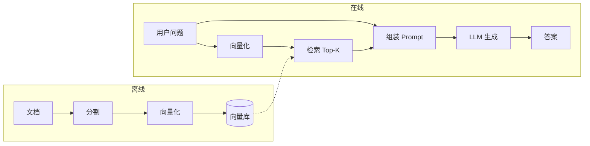
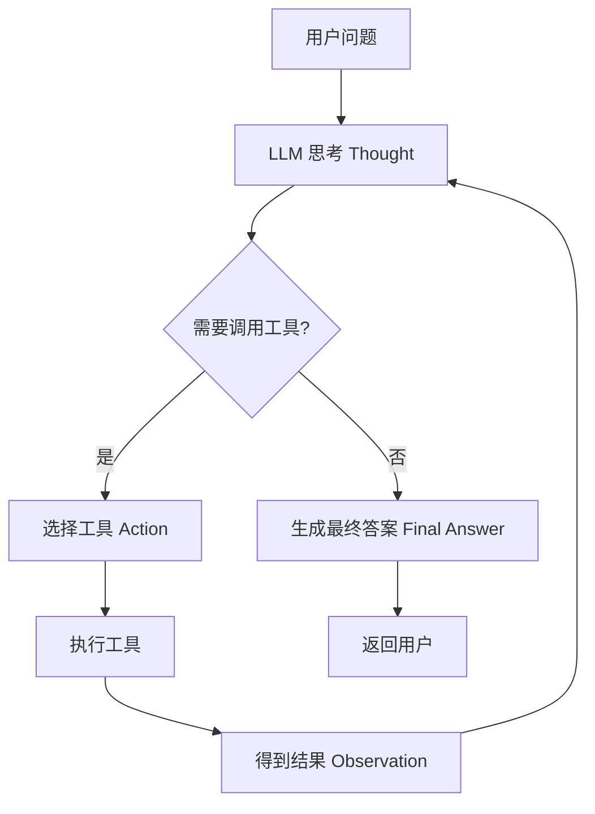

# 环境准备

项目根目录下创建 `models` 目录，下载 BGE-M3 模型。

```bash
mkdir models
cd modles
git clone https://www.modelscope.cn/BAAI/bge-m3.git
```

下载 <a href="https://github.com/explosion/spacy-models/releases/download/en_core_web_sm-3.8.0/en_core_web_sm-3.8.0-py3-none-any.whl">en-core-web-sm</a> 到 `models` 目录下。 

安装依赖：

```bash
uv sync
```

Docker compose 方式安装 PostgreSQL 和 Milvus :

```yaml
services:
  postgres:
    image: postgres:16-alpine
    container_name: postgres
    restart: unless-stopped
    environment:
      POSTGRES_USER: postgres
      POSTGRES_PASSWORD: 123456
      POSTGRES_DB: postgres
    ports:
      - "5432:5432"
    volumes:
      - postgres_data:/var/lib/postgresql/data

volumes:
  postgres_data:
```

```yaml
services:
  etcd:
    container_name: milvus-etcd
    image: quay.io/coreos/etcd:v3.5.16
    restart: unless-stopped
    environment:
      - ETCD_AUTO_COMPACTION_MODE=revision
      - ETCD_AUTO_COMPACTION_RETENTION=1000
      - ETCD_QUOTA_BACKEND_BYTES=4294967296
      - ETCD_SNAPSHOT_COUNT=50000
    volumes:
      - ${DOCKER_VOLUME_DIRECTORY:-.}/volumes/etcd:/etcd
    command: etcd -advertise-client-urls=http://etcd:2379 -listen-client-urls http://0.0.0.0:2379 --data-dir /etcd
    healthcheck:
      test: ["CMD", "etcdctl", "endpoint", "health"]
      interval: 30s
      timeout: 20s
      retries: 3

  minio:
    container_name: milvus-minio
    image: cgr.dev/chainguard/minio
    restart: unless-stopped
    user: root
    environment:
      MINIO_ROOT_USER: minioadmin
      MINIO_ROOT_PASSWORD: minioadmin
    ports:
      - "9001:9001"
      - "9000:9000"
    volumes:
      - ${DOCKER_VOLUME_DIRECTORY:-.}/volumes/minio:/minio_data
    command: ["server", "/minio_data", "--console-address", ":9001"]

  standalone:
    container_name: milvus-standalone
    image: milvusdb/milvus:v2.5.4
    restart: unless-stopped
    command: ["milvus", "run", "standalone"]
    security_opt:
      - seccomp:unconfined
    environment:
      ETCD_ENDPOINTS: etcd:2379
      MINIO_ADDRESS: minio:9000
    volumes:
      - ${DOCKER_VOLUME_DIRECTORY:-.}/volumes/milvus:/var/lib/milvus
    healthcheck:
      test: ["CMD", "curl", "-f", "http://localhost:9091/healthz"]
      interval: 30s
      start_period: 90s
      timeout: 20s
      retries: 3
    ports:
      - "19530:19530"
      - "9091:9091"
    depends_on:
      - "etcd"
      - "minio"

networks:
  default:
    name: milvus
```

```bash
docker compose up -d
```

项目根目录下复制 `.env.example` 并重命名为 `.env` ，写入相应信息 。 

# 模型调用

几个概念：

- 平台：平台有很多，比如官方平台、第三方中转站等。对应参数 `base_url` 和 `api_key` 。
- 模型：模型名要和官方的名称一致。对应参数 `model` 或 `model_name` 。
- 协议：各模型厂商都有自己专用的通信协议，对应 langchain 的 `ChatOpenAI` , `ChatAnthropic` , `ChatGoogleGenerativeAI` , `ChatDeepSeek` 等。基本上国外模型只能用自家的通信协议，而国内模型基本都兼容 OpenAI 协议。比如 langchain 官方没有集成 GLM 模型，但你可以通过 OpenAI 协议来调用。

## 调用各家 llm

CloseAI 平台使用 OpenAI 协议调用 GPT 模型：

```python
import os

from dotenv import load_dotenv
from langchain_openai import ChatOpenAI

# 读取环境变量，项目根目录下的配置将覆盖系统环境变量
load_dotenv(override=True)

llm = ChatOpenAI(
    # 必填，要和平台的模型名对应上
    model="gpt-5",
    # 这里我们用了中转站而不是官方
    # 按优先级取：显示传入 > 环境变量 OPENAI_API_BASE > 环境变量 OPENAI_BASE_URL > 官方地址
    base_url="https://api.openai-proxy.org/v1",
    # 按优先级取：显示传入 > 环境变量中OPENAI_API_KEY
    api_key=os.getenv("CLOSEAI_API_KEY"),
)

ai_message = llm.invoke(input="你好，你是谁")
print(ai_message)

```

CloseAI 平台使用 OpenAI 协议调用 DeepSeek 模型：

```python
import os

from dotenv import load_dotenv
from langchain_openai import ChatOpenAI

load_dotenv(override=True)

llm = ChatOpenAI(
    model="deepseek-v4.1-flash",
    base_url="https://api.openai-proxy.org/v1",
    api_key=os.getenv("CLOSEAI_API_KEY"),
)

ai_message = llm.invoke(input="你好，你是谁")
print(ai_message)

```

通过官方调用 DeepSeek 模型：

```python
from dotenv import load_dotenv
from langchain_deepseek import ChatDeepSeek

load_dotenv(override=True)

llm = ChatDeepSeek(
    model="deepseek-flash",
    # 参数 base_url 取官方地址
    # 参数 api_key 取环境变量 DEEPSEEK_API_KEY
)

ai_message = llm.invoke(input="你好，你是谁")
print(ai_message)

```

## init_chat_model

```python
from dotenv import load_dotenv
from langchain.chat_models import init_chat_model

load_dotenv(override=True)

llm = init_chat_model(
    # 你可以直接写 model="deepseek:deepseek-v4-flash" 从而省略 model_provider
    # model_provider 底层会去调用对应的 ChatXxx
    model="deepseek-flash",
    model_provider="deepseek",
    # 温度 [0, 2] 值越小越确定（写代码，数学问题），值越大越有创造性（写文案等），默认0.7
    temperature=1.8,
    # 最大输出长度（单位是token）
    max_tokens=24,
    # 超时时间（秒）
    timeout=60,
    # 失败重试次数
    max_retries=2,
    # openai 支持但 langchain 未列出的字段放到 model_kwargs 中透传
    # openai 不支持，但模型额外支持的字段，比如 deepseek 支持关闭思考模式
    extra_body={"thinking": {"type": "disabled"}},
)

ai_message = llm.invoke("请帮我写一首七言绝句")
print(ai_message)

```

## 消息类型

`llm.invoke(input)` 其中 `input` 参数可以传以下类型：

- `str` : 普通字符串
- `PromptValue` : 提示词模板生成的值
- `Sequence[MessageLikeRepresentation]` 类消息序列

```python
# 传入消息列表
ai_message = llm.invoke(
    [SystemMessage("你是一个人工智能专家"), HumanMessage("简单介绍一下 llm")]
)
```

```python
# 传入元组型消息列表
ai_message = llm.invoke(
    [("system", "你是一个人工智能专家"), ("human", "简单介绍一下 llm")]
)
```

```python
# 传入字典型消息列表
ai_message = llm.invoke(
    [
        {"role": "system", "content": "你是一个人工智能专家"},
        {"role": "human", "content": "简单介绍一下 langgraph"},
    ]
)
```

langchain 中一共有 4 种消息类型：

- `SystemMessage`
- `HumanMessage`
- `ToolMessage`
- `AIMessage`

## config 参数

`llm.invoke(input, config)` 其中 `config` 参数可以设置一些运行时配置。

```python
from dotenv import load_dotenv
from langchain.chat_models import init_chat_model

load_dotenv(override=True)

llm = init_chat_model(
    model="deepseek-flash",
    model_provider="deepseek",
    # 指定在运行时可以用 configurable 覆盖的字段，是个元组
    configurable_fields=("model",) 
)

ai_message = llm.invoke(
    input="你好",
    # 运行时配置
    config={
        # 一些给 langSmith 调试、追踪、日志用的字段
        "tags": ["demo"],
        "metadata": {"user_id": "123"},
        # configurable 本次调用改变模型参数
        "configurable": {
            "model": "deepseek-v4-pro",
        },
    },
)

print(ai_message)

```

## 多模态

`HumanMessage` 和 `AIMessage` 的 `content` 字段类型是 `str | list[str | dict]`，大部分情形是 `str` 。需要多模态、含推理过程、使用 Anthropic 协议时是 `list` 。langchain 使用 `content_blocks` 统一了多模态输入输出。

```python
import base64
import os

from dotenv import load_dotenv
from langchain.chat_models import init_chat_model
from langchain_core.messages import HumanMessage, ImageContentBlock, TextContentBlock

load_dotenv(override=True)

llm = init_chat_model(
    # 模型要支持多模态
    model="qwen3.8-max",
    model_provider="openai",
    base_url="https://api.openai-proxy.org/v1",
    api_key=os.getenv("CLOSEAI_API_KEY"),
)


# 读取本地图片并转为 base64 编码传输
def read_local_image(img_path: str):
    with open(img_path, "rb") as f:
        image_data = f.read()
        return base64.b64encode(image_data).decode()


# 多模态输入（使用 context_blocks 字段兼容各家协议）
human_message = HumanMessage(
    content_blocks=[
        TextContentBlock(type="text", text="描述这2张图片"),
        ImageContentBlock(
            type="image",
            url="https://fuss10.elemecdn.com/e/5d/4a731a90594a4af544c0c25941171jpeg.jpeg",
            mime_type="image/jpeg",
        ),
        ImageContentBlock(
            type="image",
            base64=read_local_image(os.path.join(os.getcwd(), "assets", "zidane.jpg")),
            mime_type="image/jpeg",
        ),
    ],
)

# 你可以使用 text 字段保证获取到的是字符串
ai_message = llm.invoke([human_message])
print(ai_message.text)

```

## invoke, stream, batch 及其异步

`invoke` : 同步非流式。

`stream` : 同步流式。

`batch` : 同步非流式并行。

`ainvoke` : `invoke` 的异步版本。

`astream` : `stream` 的异步版本。

`abatch` : `batch` 的异步版本。

测试同步：

```python
from dotenv import load_dotenv
from langchain.chat_models import init_chat_model

load_dotenv(override=True)

llm = init_chat_model(model="deepseek:deepseek-flash")

# invoke
ai_message = llm.invoke("你是谁")
print(ai_message.text)
print("=" * 100)
ai_message = llm.invoke("介绍一下llm")
print(ai_message.text)
print("=" * 100)

# batch
ai_messages = llm.batch(["你是谁", "介绍一下llm"])
for ai_message in ai_messages:
    print(ai_message.text)
    print("=" * 100)

# stream
ai_message_chunks = llm.stream("介绍一下llm")
for ai_message_chunk in ai_message_chunks:
    print(ai_message_chunk.text, end="", flush=True)

```

你可以使用以下命令来监控文件的追加写，从而观察异步。

```python
# linux
tail -F <file>

# windows(powershell)
Get-Content -Path <file> -Wait -Encoding UTF8
```

测试 `ainvoke` :

```python
import asyncio

from dotenv import load_dotenv
from langchain.chat_models import init_chat_model

load_dotenv(override=True)

model = init_chat_model(model="deepseek:deepseek-flash")


# ainvoke
async def async_write_novel(output_file: str):
    with open(output_file, "w", encoding="utf-8") as f:  # noqa: ASYNC230
        ai_message = await model.ainvoke("帮我写一篇500字的小说")
        f.write(ai_message.text)
    print(f"已写入{output_file}")


async def async_write_novels(*output_files: str):
    async_tasks = []
    for output_file in output_files:
        # 这里不能加 await，异步函数不执行，返回一个协程对象
        async_task = async_write_novel(output_file)
        async_tasks.append(async_task)
    await asyncio.gather(*async_tasks)


if __name__ == "__main__":
    # 两个文件是并行非流式写的
    asyncio.run(async_write_novels("./novel1.txt", "./novel2.txt"))

```

测试 `astream` :

```python
import asyncio

from dotenv import load_dotenv
from langchain.chat_models import init_chat_model

load_dotenv(override=True)

model = init_chat_model(model="deepseek:deepseek-flash")


# astream
async def async_write_novel(output_file: str):
    with open(output_file, "w", encoding="utf-8") as f:  # noqa: ASYNC230
        astream = model.astream("帮我写一篇500字的小说")
        async for ai_message_chunk in astream:
            f.write(ai_message_chunk.content)
            f.flush()
    print(f"已写入{output_file}")


async def async_write_novels(*output_files: str):
    async_tasks = []
    for output_file in output_files:
        async_task = async_write_novel(output_file)
        async_tasks.append(async_task)
    await asyncio.gather(*async_tasks)


if __name__ == "__main__":
    # 两个文件是并行流式写的
    asyncio.run(async_write_novels("./novel1.txt", "./novel2.txt"))

```

测试 `abatch` :

```python
import asyncio

from dotenv import load_dotenv
from langchain.chat_models import init_chat_model

load_dotenv(override=True)

model = init_chat_model(model="deepseek:deepseek-flash")


async def test_abatch():
    ai_messages = await model.abatch(["你是谁", "介绍一下llm"])
    return [ai_message.text for ai_message in ai_messages]


if __name__ == "__main__":
    answers = asyncio.run(test_abatch())
    print(answers)

```

# 提示词模板

## PromptTemplate

```python
from langchain_core.prompts import PromptTemplate

# 创建 PromptTemplate（单字符串形式的提示词模板）
prompt_template = PromptTemplate.from_template(
    template="请解释一下{topic}，要求使用{language}和{style}风格"
)

# 固定部分参数
prompt_template = prompt_template.partial(language="中文", style="通俗易懂")

# 格式化 PromptTemplate，返回 StringPromptValue（单字符串形式的提示词值）
str_prompt_value = prompt_template.invoke({"topic": "人工智能"})
print(str_prompt_value, type(str_prompt_value))

```

## FewShotPromptTemplate

```python
from dotenv import load_dotenv
from langchain.chat_models import init_chat_model
from langchain_core.prompts import FewShotPromptTemplate, PromptTemplate

load_dotenv(override=True)

llm = init_chat_model(model="deepseek:deepseek-flash")

# 定义样例列表
examples = [
    {"course": "大模型介绍", "importance": 1},
    {"course": "dify&coze", "importance": 2},
    {"course": "langchain", "importance": 4.5},
    {"course": "langgraph", "importance": 5},
]

# 这里的 course 和 importance 要和上面 examples 要一一对应
example_prompt = PromptTemplate.from_template(
    "课程：{course}，重要指数（满分5星）：{importance}星"
)

# 带样例的单字符串形式的提示词模板
# 前缀 + "\n\n" + 遍历 examples 生成 example_prompt + "\n\n" + 后缀
few_shot_prompt_template = FewShotPromptTemplate(
    examples=examples,
    example_prompt=example_prompt,
    prefix="以下是大模型相关课程",
    suffix="请帮我列出重要性>={custom_importance}星课程",
    input_variables=["custom_importance"],
)

# 格式化后返回的是 StringPromptValue
str_prompt_value = few_shot_prompt_template.invoke({"custom_importance": 4})

ai_message = llm.invoke(str_prompt_value)
print(ai_message.content)

```

## ChatPromptTemplate

```python
from langchain_core.prompts import ChatPromptTemplate

# 创建 ChatPromptTemplate（多轮对话提示词模板）
chat_prompt_template = ChatPromptTemplate.from_messages(
    # 你可以使用元组列表、字典列表
    # 但不能使用内置的消息列表，放到 content 中的内容不解析
    [("system", "你是一个{area}领域的专家"), ("human", "{question}")]
)

# 格式化，返回 ChatPromptValue（多轮对话形式的提示词值）
chat_prompt_value = chat_prompt_template.invoke(
    {"area": "python", "question": "什么是装饰器"}
)
print(chat_prompt_value, type(chat_prompt_value))

```

## MessagesPlaceholder

```python
from langchain_core.messages import AIMessage, HumanMessage
from langchain_core.prompts import ChatPromptTemplate

chat_prompt_template = ChatPromptTemplate.from_messages(
    [
        ("system", "你是一个ai助手"),
        # 在 ChatPromptTemplate 预留占位，传入的值要求是 Sequence[MessageLikeRepresentation] 类消息序列
        # 下面是简写形式，等价于 MessagesPlaceholder(variable_name="history")
        ("placeholder", "{history}"),
        ("human", "{question}"),
    ]
)

chat_prompt_value = chat_prompt_template.invoke(
    {
        "history": [
            HumanMessage("什么是 python"),
            AIMessage("python 是一门编程语言"),
        ],
        "question": "它有什么用",
    }
)
print(chat_prompt_value)

```

# 格式化输出

```python
import re
from typing import Literal

from dotenv import load_dotenv
from langchain.chat_models import init_chat_model
from pydantic import BaseModel, Field, field_validator

load_dotenv(override=True)

llm = init_chat_model(
    model="deepseek:deepseek-flash",
    # deepseek 思考模式不支持格式化输出，关了
    extra_body={"thinking": {"type": "disabled"}},
)


# 继承 pydantic 的 BaseModel
class Person(BaseModel):
    # 大模型能看见这些参数定义，会自己去填补修正
    # 姓名，必填，字符串型，最少2字符，最多20字符
    name: str = Field(description="姓名", min_length=2, max_length=20)
    # 年龄，必填，整形，0 <=age <= 200
    age: int = Field(description="年龄", ge=0, le=200)
    # 性别，必填，"male" or "female"
    gender: Literal["male", "female"] = Field(description="性别")
    # 联系方式，非必填，符合正则校验
    phone: str | None = Field(
        description="联系方式", pattern=r"^1[3-9]\d{9}$", default=None
    )

    # 大模型看不见这些，校验不通过会抛异常
    @field_validator("name")
    @classmethod
    def validate_name(cls, value: str):
        """姓名中不能有数字"""
        if re.search(r"\d", value):
            raise ValueError("姓名中不能包含数字")
        return value


structed_model = llm.with_structured_output(schema=Person)

try:
    # llm 会根据约束自己去填补，如果最终转换不通过还是会抛异常
    person1 = structed_model.invoke("你好，我是小明")
    print(person1)
    person2 = structed_model.invoke("我是123")
    print(person2)
except ValueError as e:
    print(e)

```

# 链式调用

langchain 中大部分组件都实现了 `runnable` 接口，意味着它们可以调用 `invoke` , `stream` , `batch` 及其异步方法。

## 简单顺序链

```python
from dotenv import load_dotenv
from langchain.chat_models import init_chat_model
from langchain_core.output_parsers import StrOutputParser
from langchain_core.prompts import ChatPromptTemplate

load_dotenv(override=True)

# 简单顺序链
# | 管道符把上一个的输出作为下一个的输入
chain = (
    ChatPromptTemplate.from_messages(
        [
            ("system", "你是一个{area}领域的专家，你要回答用户相关问题，回答要{style}"),
            ("human", "{question}"),
        ]
    )
    | init_chat_model(model="deepseek:deepseek-flash")
    | StrOutputParser()
)


answer = chain.invoke(
    {"area": "人工智能", "style": "简洁明了", "question": "介绍一下国内外有哪些主流llm"}
)
print(answer)

```

## 并行链

```python
from dotenv import load_dotenv
from langchain.chat_models import init_chat_model
from langchain_core.output_parsers import StrOutputParser
from langchain_core.prompts import PromptTemplate
from langchain_core.runnables import RunnablePassthrough

load_dotenv(override=True)


def rag(query: str):
    """模拟rag"""
    return "我们是ai初创公司，主营企业级agent服务，公司员工有10人。"


# 并行链
chain = (
    # RunablePassthrough 将原样输出
    # 字典遇到 | 将变成一个并行结构
    # 函数遇到 | 将自动包裹变成一个 runnable 对象
    {"query": RunnablePassthrough(), "context": rag}
    | PromptTemplate.from_template("问题：{query}\n\n这是上下文背景{context}")
    | init_chat_model(model="deepseek:deepseek-chat")
    | StrOutputParser()
)

answer = chain.invoke("公司有多少人")
print(answer)

```

# RAG

## 简介

大模型存在以下局限：

- 训练语料有时间范围，无法回答最新问题。
- 训练语料只含公开数据，专业领域回答不准确。
- 幻觉：Transformer 架构是预测 token 概论，会一本正经胡说八道。

RAG（Retrieval-Augmented Generation，检索增强生成）的基本思想为：通过检索技术为大模型补充上下文，相当于在大模型回答时给它一本参考书。

RAG 的基本流程：



## 加载文档

langchain 集成了 `UnstructuredLoader` 读取文档。

```python
from langchain_unstructured.document_loaders import UnstructuredLoader


# 加载文档
def load_doc(file_path: str, mode="single"):
    try:
        loader = UnstructuredLoader(
            file_path=file_path,
            # mode 取值 "single" / "elements"
            # single: 返回列表里只有一整个文档。
            # elements: markdown 标题、段落、列表等都视为元素。word 一行视为一个元素。返回多个文档组成的列表。
            mode=mode,
        )
        docs = loader.load()
        print(f"加载{file_path}成功")
        return docs
    except Exception as e:  # noqa: BLE001
        print(e)

```

## PDF 处理

我们可以使用 MinerU 将 PDF 转为 Markdown 再进行读取。

参考：https://mineru.net/apiManage/docs

```python
import os
import time

import requests
from dotenv import load_dotenv

load_dotenv(override=True)

BASE_URL = "https://mineru.net/api/v4"


def _get_token() -> str:
    """从环境变量读取 MinerU API Token。"""
    token = os.getenv("MINERU_API_KEY")
    if not token:
        raise OSError("未找到环境变量 MINERU_API_KEY，请先设置再运行。")
    return token


def _headers() -> dict:
    return {
        "Content-Type": "application/json",
        "Authorization": f"Bearer {_get_token()}",
    }


# ── 1. 申请上传链接 ──────────────────────────────────
def get_upload_urls(
    files: list[dict],
    model_version: str = "vlm",
    enable_formula: bool = True,
    enable_table: bool = True,
    language: str = "ch",
) -> dict:
    """
    批量申请文件上传链接。

    :param files: [{"name": "xxx.pdf", "data_id": "id1"}, ...]
    :param model_version: pipeline / vlm / MinerU-HTML
    :return: {"batch_id": str, "file_urls": [str, ...]}
    """
    url = f"{BASE_URL}/file-urls/batch"
    payload = {
        "files": files,
        "model_version": model_version,
        "enable_formula": enable_formula,
        "enable_table": enable_table,
        "language": language,
    }

    resp = requests.post(url, headers=_headers(), json=payload, timeout=30)
    resp.raise_for_status()
    result = resp.json()

    if result.get("code") != 0:
        raise RuntimeError(f"申请上传链接失败: {result.get('msg')}")

    return {
        "batch_id": result["data"]["batch_id"],
        "file_urls": result["data"]["file_urls"],
    }


# ── 2. 上传文件到预签名 URL ──────────────────────────
def upload_file(upload_url: str, local_path: str) -> bool:
    """将单个本地文件 PUT 到预签名上传链接。"""
    with open(local_path, "rb") as f:
        # 注意：上传时无须设置 Content-Type 头
        resp = requests.put(upload_url, data=f, timeout=300)
    return resp.status_code == 200


# ── 3. 轮询批量解析结果 ─────────────────────────────
def poll_batch_results(
    batch_id: str,
    interval: int = 10,
    timeout: int = 1800,
) -> list[dict]:
    """
    轮询查询批量解析结果，直到所有文件处理完成或超时。

    :param batch_id: 批量任务 ID
    :param interval: 轮询间隔（秒）
    :param timeout: 最大等待时间（秒）
    :return: 每个文件的解析结果列表，包含 full_zip_url 等字段
    """
    url = f"{BASE_URL}/extract-results/batch/{batch_id}"
    start = time.time()

    while True:
        if time.time() - start > timeout:
            raise TimeoutError(f"轮询超时（{timeout}s），batch_id={batch_id}")

        resp = requests.get(url, headers=_headers(), timeout=30)
        resp.raise_for_status()
        result = resp.json()

        if result.get("code") != 0:
            raise RuntimeError(f"查询结果失败: {result.get('msg')}")

        extract_results = result["data"]["extract_result"]

        # 检查是否全部完成（done 或 failed）
        all_finished = all(r["state"] in ("done", "failed") for r in extract_results)
        if all_finished:
            return extract_results

        done_count = sum(1 for r in extract_results if r["state"] == "done")
        print(
            f"  [轮询] {done_count}/{len(extract_results)} 已完成 (等待 {interval}s...)"
        )
        time.sleep(interval)


# ── 4. 下载结果压缩包 ──────────────────────────────
def download_result(
    full_zip_url: str,
    save_dir: str,
    file_name: str,
    data_id: str,
) -> str:
    """下载解析结果 ZIP 到本地。"""
    os.makedirs(save_dir, exist_ok=True)
    save_path = os.path.join(save_dir, f"{file_name}_{data_id}.zip")

    resp = requests.get(full_zip_url, stream=True, timeout=300)
    resp.raise_for_status()

    with open(save_path, "wb") as f:
        f.writelines(resp.iter_content(chunk_size=8192))

    return save_path


# ── 顶层便捷函数 ─────────────────────────────────────────
def batch_upload_and_get_download_urls(
    pdf_paths: list[str],
    model_version: str = "vlm",
    enable_formula: bool = True,
    enable_table: bool = True,
    language: str = "ch",
    poll_interval: int = 10,
    poll_timeout: int = 1800,
    save_dir: str | None = None,
) -> list[dict]:
    """
    批量上传本地 PDF 并获取解析结果下载链接。

    从环境变量 MINERU_API_KEY 读取 Token。

    :param pdf_paths: 本地 PDF 文件路径列表（单次最多 50 个）
    :param model_version: pipeline / vlm / MinerU-HTML
    :param save_dir: 若提供，则自动下载 ZIP 到该目录
    :return: [{"file_name": str, "data_id": str, "state": str, "full_zip_url": str}, ...]
    """
    # 校验文件存在性
    for p in pdf_paths:
        if not os.path.isfile(p):
            raise FileNotFoundError(f"文件不存在: {p}")

    if len(pdf_paths) > 50:
        raise ValueError(f"单次最多上传 50 个文件，当前: {len(pdf_paths)}")

    # 构建文件信息列表
    files_info = [
        {"name": os.path.basename(p), "data_id": f"file_{i}"}
        for i, p in enumerate(pdf_paths)
    ]

    # Step 1: 申请上传链接
    print(f"[1/3] 申请上传链接（{len(pdf_paths)} 个文件）...")
    upload_info = get_upload_urls(
        files=files_info,
        model_version=model_version,
        enable_formula=enable_formula,
        enable_table=enable_table,
        language=language,
    )
    batch_id = upload_info["batch_id"]
    upload_urls = upload_info["file_urls"]
    print(f"  batch_id = {batch_id}")

    # Step 2: 逐个上传
    print("[2/3] 上传文件...")
    for upload_url, local_path in zip(upload_urls, pdf_paths):
        ok = upload_file(upload_url, local_path)
        status = "✅" if ok else "❌"
        print(f"  {status} {os.path.basename(local_path)}")
        if not ok:
            raise RuntimeError(f"上传失败: {local_path}")

    # Step 3: 轮询结果
    print(f"[3/3] 等待解析完成（轮询间隔 {poll_interval}s）...")
    results = poll_batch_results(batch_id, interval=poll_interval, timeout=poll_timeout)

    # 整理返回结果 & 可选下载
    output = []
    for r in results:
        item = {
            "file_name": r["file_name"],
            "data_id": r["data_id"],
            "state": r["state"],
            "full_zip_url": r.get("full_zip_url", ""),
            "err_msg": r.get("err_msg", ""),
        }
        output.append(item)

        if save_dir and r["state"] == "done" and r.get("full_zip_url"):
            saved = download_result(
                r["full_zip_url"], save_dir, r["file_name"], r["data_id"]
            )
            print(f"  📦 已下载: {saved}")

    return output


# ── 使用示例 ────────────────────────────────────────────
if __name__ == "__main__":
    pdfs = [os.path.join(os.getcwd(), "assets", "sample.pdf")]

    results = batch_upload_and_get_download_urls(
        pdf_paths=pdfs,
        model_version="vlm",  # 推荐使用 vlm 模型
        save_dir=os.path.join(os.getcwd(), "assets"),
    )

```

## 切分文档

```python
from langchain_core.documents.base import Document
from langchain_text_splitters import RecursiveCharacterTextSplitter


# 切分文档
def split_docs(docs: list[Document]):
    # 递归字符切分器
    # 对每个 doc 按分隔符优先级递归切分，直到每块不超过最大长度
    splitter = RecursiveCharacterTextSplitter(
        # 分隔符
        separators=[
            "\r\n\r\n",
            "\n\n",
            "\r\n",
            "\n",
            "。",
            "！",
            "？",
            "；",
            "：",
            "，",
            "、",
            ". ",
            "! ",
            "? ",
            "; ",
            ": ",
            ", ",
            ".",
            "!",
            "?",
            ";",
            ":",
            ",",
            " ",
            "",
        ],
        # 每块最大长度
        chunk_size=1024,
        # 相邻块重叠长度，保持语义连贯
        chunk_overlap=256,
        # 按字符数计算
        length_function=len,
    )
    chunks = splitter.split_documents(docs)
    print(f"切分为{len(chunks)}块")
    return chunks

```

## 向量化

我们使用嵌入模型进行向量化。嵌入模型需要关注的点：

- 支持的语言
- 是否支持稠密向量（语义检索）和稀疏向量（关键字检索）
- 稠密向量输出维度
- 是否开源，可本地部署

我们使用 BGE-M3 实现向量化：

```python
import numpy as np
import torch
from FlagEmbedding import BGEM3FlagModel
from langchain_core.documents.base import Document


# 加载嵌入模型
def load_bge_m3(model_name_or_path: str):
    device = "cuda" if torch.cuda.is_available() else "cpu"
    try:
        model = BGEM3FlagModel(
            model_name_or_path=model_name_or_path,
            use_fp16=(device == "cuda"),
        )
        if device == "cuda":
            model.model.to(device)
        print("BGE-M3 加载完成")
        return model
    except Exception as e:  # noqa: BLE001
        print(e)


# 向量化
def get_embeddings(
    inputs: list[Document] | list[str],
    model,
    batch_size: int = 100,
) -> list[dict]:
    # 统一取出文本，保留原始对象用于后面组装 metadata
    texts = [item if isinstance(item, str) else item.page_content for item in inputs]

    total = len(texts)
    dense_vectors: list = []
    sparse_vectors: list = []

    # 分批处理
    for start in range(0, total, batch_size):
        end = min(start + batch_size, total)
        batch_texts = texts[start:end]
        output = model.encode(
            sentences=batch_texts,
            return_dense=True,
            return_sparse=True,
            return_colbert_vecs=False,  # 不需要 ColBERT，省算力
        )
        dense_vectors.extend(output["dense_vecs"])
        sparse_vectors.extend(output["lexical_weights"])

        percent = end / total * 100
        print(f"向量化进度：{percent:6.2f}% ({end}/{total})")

    # 组装最终结果
    embeddings = []
    for dense_vector, sparse_vector, input_item, text in zip(
        dense_vectors, sparse_vectors, inputs, texts
    ):
        # 存入 milvus 的稠密向量必须是 float32
        dense_vector = np.asarray(dense_vector, dtype=np.float32)
        # 存入 milvus 的稀疏向量键必须是 int
        sparse_vector = {int(k): float(v) for k, v in sparse_vector.items()}

        embedding_item = {
            "dense_vector": dense_vector,
            "sparse_vector": sparse_vector,
            "text": text,
        }
        # 如果原始输入是 Document，把 metadata 也带上
        if not isinstance(input_item, str):
            embedding_item["metadata"] = input_item.metadata
        embeddings.append(embedding_item)

    print(f"向量化完成，共 {len(embeddings)} 条")
    return embeddings

```

## 写入 Milvus 数据库

参见：https://milvus.io/docs/zh

稠密向量：https://milvus.io/docs/zh/dense-vector.md

稀疏向量：https://milvus.io/docs/zh/sparse_vector.md

HNSW：https://milvus.io/docs/zh/v2.6.x/hnsw.md

SPARSE_INVERTED_INDEX：https://milvus.io/docs/zh/v2.6.x/sparse-inverted-index.md

向量距离的度量：

- 稠密向量一般用 COSINE ，如果已归一化则可以用 IP 。
- 稀疏向量一般用 IP 。

```python
import os

from dotenv import load_dotenv
from pymilvus import DataType, MilvusClient

load_dotenv(override=True)


# 连接数据库
def connect_milvus():
    try:
        uri = os.getenv("MILVUS_URI")
        client = MilvusClient(uri)
        print("连接数据库成功")
        return client
    except Exception as e:  # noqa: BLE001
        print(e)


# 创建 schema（对应关系数据库表的结构）
def build_schema():
    schema = MilvusClient.create_schema(auto_id=True)
    # 主键
    schema.add_field(field_name="id", datatype=DataType.INT64, is_primary=True)
    # 字段名要和向量化后的结果一一对应
    # 稠密向量
    schema.add_field(
        field_name="dense_vector", datatype=DataType.FLOAT_VECTOR, dim=1024
    )
    # 稀疏向量
    schema.add_field(field_name="sparse_vector", datatype=DataType.SPARSE_FLOAT_VECTOR)
    # 原始文本，max_length 是字节
    schema.add_field(field_name="text", datatype=DataType.VARCHAR, max_length=10000)
    # 元数据
    schema.add_field(field_name="metadata", datatype=DataType.JSON)
    return schema


# 配置索引（对应关系数据库的索引）
def build_index():
    index_params = MilvusClient.prepare_index_params()
    # 稠密向量，一般用 HNSW（分层导航小世界），距离度量一般用COSINE，如果归一化了可以用IP
    # HNSW：https://milvus.io/docs/zh/v2.6.x/hnsw.md
    index_params.add_index(
        field_name="dense_vector", index_type="HNSW", metric_type="COSINE"
    )
    # 稀疏向量，只能用（SPARSE_INVERTED_INDEX）稀疏倒排索引，距离度量一般用IP（内积）
    # SPARSE_INVERTED_INDEX：https://milvus.io/docs/zh/v2.6.x/sparse-inverted-index.md
    index_params.add_index(
        field_name="sparse_vector", index_type="SPARSE_INVERTED_INDEX", metric_type="IP"
    )
    return index_params


# 创建集合（对应关系数据库的表）
def create_collection(client: MilvusClient, collection_name: str):
    try:
        if not client.has_collection(collection_name):
            client.create_collection(
                collection_name=collection_name,
                schema=build_schema(),
                index_params=build_index(),
            )
            print(f"创建集合{collection_name}成功")
        else:
            print(f"集合{collection_name}已存在")
    except Exception as e:  # noqa: BLE001
        print(e)


# 添加数据
def insert_data(
    client: MilvusClient, collection_name: str, data: list[dict], batch_size: int = 100
):
    try:
        total = len(data)
        for i in range(0, total, batch_size):
            batch = data[i : i + batch_size]
            client.insert(collection_name, batch)
            inserted = min(i + batch_size, total)
            percent = inserted / total * 100
            print(f"插入进度：{percent:.2f}% ({inserted}/{total})")
    except Exception as e:  # noqa: BLE001
        print(e)

```

## 完整的离线流程

```python
import os

import numpy as np
import torch
from dotenv import load_dotenv
from FlagEmbedding import BGEM3FlagModel
from langchain_core.documents.base import Document
from langchain_text_splitters import RecursiveCharacterTextSplitter
from langchain_unstructured.document_loaders import UnstructuredLoader
from pymilvus import DataType, MilvusClient

load_dotenv(override=True)


# 加载文档
def load_doc(file_path: str, mode="single"):
    try:
        loader = UnstructuredLoader(
            file_path=file_path,
            # mode 取值 "single" / "elements"
            # single: 返回列表里只有一整个文档。
            # elements: markdown 标题、段落、列表等都视为元素。word 一行视为一个元素。返回多个文档组成的列表。
            mode=mode,
        )
        docs = loader.load()
        print(f"加载{file_path}成功")
        return docs
    except Exception as e:  # noqa: BLE001
        print(e)


# 切分文档
def split_docs(docs: list[Document]):
    # 递归字符切分器
    # 对每个 doc 按分隔符优先级递归切分，直到每块不超过最大长度
    splitter = RecursiveCharacterTextSplitter(
        # 分隔符
        separators=[
            "\r\n\r\n",
            "\n\n",
            "\r\n",
            "\n",
            "。",
            "！",
            "？",
            "；",
            "：",
            "，",
            "、",
            ". ",
            "! ",
            "? ",
            "; ",
            ": ",
            ", ",
            ".",
            "!",
            "?",
            ";",
            ":",
            ",",
            " ",
            "",
        ],
        # 每块最大长度
        chunk_size=1024,
        # 相邻块重叠长度，保持语义连贯
        chunk_overlap=256,
        # 按字符数计算
        length_function=len,
    )
    chunks = splitter.split_documents(docs)
    print(f"切分为{len(chunks)}块")
    return chunks


# 加载嵌入模型
def load_bge_m3(model_name_or_path: str):
    device = "cuda" if torch.cuda.is_available() else "cpu"
    try:
        model = BGEM3FlagModel(
            model_name_or_path=model_name_or_path,
            use_fp16=(device == "cuda"),
        )
        if device == "cuda":
            model.model.to(device)
        print("BGE-M3 加载完成")
        return model
    except Exception as e:  # noqa: BLE001
        print(e)


# 向量化
def get_embeddings(
    inputs: list[Document] | list[str],
    model,
    batch_size: int = 100,
) -> list[dict]:
    # 统一取出文本，保留原始对象用于后面组装 metadata
    texts = [item if isinstance(item, str) else item.page_content for item in inputs]

    total = len(texts)
    dense_vectors: list = []
    sparse_vectors: list = []

    # 分批处理
    for start in range(0, total, batch_size):
        end = min(start + batch_size, total)
        batch_texts = texts[start:end]
        output = model.encode(
            sentences=batch_texts,
            return_dense=True,
            return_sparse=True,
            return_colbert_vecs=False,  # 不需要 ColBERT，省算力
        )
        dense_vectors.extend(output["dense_vecs"])
        sparse_vectors.extend(output["lexical_weights"])

        percent = end / total * 100
        print(f"向量化进度：{percent:6.2f}% ({end}/{total})")

    # 组装最终结果
    embeddings = []
    for dense_vector, sparse_vector, input_item, text in zip(
        dense_vectors, sparse_vectors, inputs, texts
    ):
        # 存入 milvus 的稠密向量必须是 float32
        dense_vector = np.asarray(dense_vector, dtype=np.float32)
        # 存入 milvus 的稀疏向量键必须是 int
        sparse_vector = {int(k): float(v) for k, v in sparse_vector.items()}

        embedding_item = {
            "dense_vector": dense_vector,
            "sparse_vector": sparse_vector,
            "text": text,
        }
        # 如果原始输入是 Document，把 metadata 也带上
        if not isinstance(input_item, str):
            embedding_item["metadata"] = input_item.metadata
        embeddings.append(embedding_item)

    print(f"向量化完成，共 {len(embeddings)} 条")
    return embeddings


# 连接数据库
def connect_milvus():
    try:
        uri = os.getenv("MILVUS_URI")
        client = MilvusClient(uri)
        print("连接数据库成功")
        return client
    except Exception as e:  # noqa: BLE001
        print(e)


# 创建 schema（对应关系数据库表的结构）
def build_schema():
    schema = MilvusClient.create_schema(auto_id=True)
    # 主键
    schema.add_field(field_name="id", datatype=DataType.INT64, is_primary=True)
    # 字段名要和向量化后的结果一一对应
    # 稠密向量
    schema.add_field(
        field_name="dense_vector", datatype=DataType.FLOAT_VECTOR, dim=1024
    )
    # 稀疏向量
    schema.add_field(field_name="sparse_vector", datatype=DataType.SPARSE_FLOAT_VECTOR)
    # 原始文本，max_length 是字节
    schema.add_field(field_name="text", datatype=DataType.VARCHAR, max_length=10000)
    # 元数据
    schema.add_field(field_name="metadata", datatype=DataType.JSON)
    return schema


# 配置索引（对应关系数据库的索引）
def build_index():
    index_params = MilvusClient.prepare_index_params()
    # 稠密向量，一般用 HNSW（分层导航小世界），距离度量一般用COSINE，如果归一化了可以用IP
    # HNSW：https://milvus.io/docs/zh/v2.6.x/hnsw.md
    index_params.add_index(
        field_name="dense_vector", index_type="HNSW", metric_type="COSINE"
    )
    # 稀疏向量，只能用（SPARSE_INVERTED_INDEX）稀疏倒排索引，距离度量一般用IP（内积）
    # SPARSE_INVERTED_INDEX：https://milvus.io/docs/zh/v2.6.x/sparse-inverted-index.md
    index_params.add_index(
        field_name="sparse_vector", index_type="SPARSE_INVERTED_INDEX", metric_type="IP"
    )
    return index_params


# 创建集合（对应关系数据库的表）
def create_collection(client: MilvusClient, collection_name: str):
    try:
        if not client.has_collection(collection_name):
            client.create_collection(
                collection_name=collection_name,
                schema=build_schema(),
                index_params=build_index(),
            )
            print(f"创建集合{collection_name}成功")
        else:
            print(f"集合{collection_name}已存在")
    except Exception as e:  # noqa: BLE001
        print(e)


# 添加数据
def insert_data(
    client: MilvusClient, collection_name: str, data: list[dict], batch_size: int = 100
):
    try:
        total = len(data)
        for i in range(0, total, batch_size):
            batch = data[i : i + batch_size]
            client.insert(collection_name, batch)
            inserted = min(i + batch_size, total)
            percent = inserted / total * 100
            print(f"插入进度：{percent:.2f}% ({inserted}/{total})")
    except Exception as e:  # noqa: BLE001
        print(e)


# 完整离线流程
def main():
    # 加载文档
    docs = load_doc(os.path.join(os.getcwd(), "assets", "sample.docx"))
    if not docs:
        return
    # 切分文档
    chunks = split_docs(docs)
    if not chunks:
        return
    # 向量化
    bge_m3 = load_bge_m3(os.path.join(os.getcwd(), "models", "bge-m3"))
    if not bge_m3:
        return
    embedding_data = get_embeddings(chunks, bge_m3)
    # 写入数据库
    client = connect_milvus()
    if not client:
        return
    if client.has_collection("demo"):
        client.drop_collection("demo")
    create_collection(client, "demo")
    insert_data(client, "demo", embedding_data)


if __name__ == "__main__":
    main()

```

## 检索

在线过程用的嵌入模型以及字段必须和离线过程一致。

RRFRanker: https://milvus.io/docs/zh/v2.6.x/rrf-ranker.md

WeightedRanker: https://milvus.io/docs/zh/v2.6.x/reranking.md

```python
from pymilvus import AnnSearchRequest, MilvusClient, RRFRanker


# 根据稠密向量搜索
def search_by_dense_vector(
    client: MilvusClient,
    collection_name: str,
    dense_data: list[list],
    limit=10,
):
    return client.search(
        data=dense_data,
        collection_name=collection_name,
        anns_field="dense_vector",
        search_params={"metric_type": "COSINE"},
        output_fields=["id", "text", "metadata"],
        limit=limit,
    )


# 根据稀疏向量搜索
def search_by_sparse_vector(
    client: MilvusClient,
    collection_name: str,
    sparse_data: list[dict],
    limit=10,
):
    return client.search(
        data=sparse_data,
        collection_name=collection_name,
        anns_field="sparse_vector",
        search_params={"metric_type": "IP"},
        output_fields=["id", "text", "metadata"],
        limit=limit,
    )


# 混合检索
def hybrid_search(
    client: MilvusClient,
    collection_name: str,
    dense_data: list[list],
    sparse_data: list[dict],
    dense_limit=10,
    sparse_limit=10,
    all_limit=5,
):
    dense_search = AnnSearchRequest(
        data=dense_data,
        anns_field="dense_vector",
        param={"metric_type": "COSINE"},
        limit=dense_limit,
    )
    sparse_search = AnnSearchRequest(
        data=sparse_data,
        anns_field="sparse_vector",
        param={"metric_type": "IP"},
        limit=sparse_limit,
    )
    return client.hybrid_search(
        collection_name=collection_name,
        reqs=[dense_search, sparse_search],
        # 这里使用 RRFRanker 基于排名倒数的重排序
        # RRFRanker: https://milvus.io/docs/zh/v2.6.x/rrf-ranker.md#RRF-Ranker
        # 如果你想指定权重你也可以使用 WeightedRanker 基于权重的重排序
        # WeightedRanker: https://milvus.io/docs/zh/v2.6.x/reranking.md#WeightedRanker
        ranker=RRFRanker(),
        limit=all_limit,
        output_fields=["id", "text", "metadata"],
    )


# 标量检索
# 类似 sql ，例如 filter="text like '%合同%'"
def query(client: MilvusClient, collection_name: str, filter: str, limit=5):
    return client.query(
        collection_name=collection_name,
        filter=filter,
        output_fields=["id", "text", "metadata"],
        limit=limit,
    )

```

## 完整在线流程

```python
import os

import numpy as np
import torch
from dotenv import load_dotenv
from FlagEmbedding import BGEM3FlagModel
from langchain.chat_models import init_chat_model
from langchain_core.documents.base import Document
from langchain_core.output_parsers import StrOutputParser
from langchain_core.prompts import ChatPromptTemplate
from langchain_core.runnables import RunnablePassthrough
from pymilvus import AnnSearchRequest, MilvusClient, RRFRanker

load_dotenv(override=True)


# 加载嵌入模型
def load_bge_m3(model_name_or_path: str):
    device = "cuda" if torch.cuda.is_available() else "cpu"
    try:
        model = BGEM3FlagModel(
            model_name_or_path=model_name_or_path,
            use_fp16=(device == "cuda"),
        )
        if device == "cuda":
            model.model.to(device)
        print("BGE-M3 加载完成")
        return model
    except Exception as e:  # noqa: BLE001
        print(e)


# 向量化
def get_embeddings(
    inputs: list[Document] | list[str],
    model,
    batch_size: int = 100,
) -> list[dict]:
    # 统一取出文本，保留原始对象用于后面组装 metadata
    texts = [item if isinstance(item, str) else item.page_content for item in inputs]

    total = len(texts)
    dense_vectors: list = []
    sparse_vectors: list = []

    # 分批处理
    for start in range(0, total, batch_size):
        end = min(start + batch_size, total)
        batch_texts = texts[start:end]
        output = model.encode(
            sentences=batch_texts,
            return_dense=True,
            return_sparse=True,
            return_colbert_vecs=False,  # 不需要 ColBERT，省算力
        )
        dense_vectors.extend(output["dense_vecs"])
        sparse_vectors.extend(output["lexical_weights"])

        percent = end / total * 100
        print(f"向量化进度：{percent:6.2f}% ({end}/{total})")

    # 组装最终结果
    embeddings = []
    for dense_vector, sparse_vector, input_item, text in zip(
        dense_vectors, sparse_vectors, inputs, texts
    ):
        # 存入 milvus 的稠密向量必须是 float32
        dense_vector = np.asarray(dense_vector, dtype=np.float32)
        # 存入 milvus 的稀疏向量键必须是 int
        sparse_vector = {int(k): float(v) for k, v in sparse_vector.items()}

        embedding_item = {
            "dense_vector": dense_vector,
            "sparse_vector": sparse_vector,
            "text": text,
        }
        # 如果原始输入是 Document，把 metadata 也带上
        if not isinstance(input_item, str):
            embedding_item["metadata"] = input_item.metadata
        embeddings.append(embedding_item)

    print(f"向量化完成，共 {len(embeddings)} 条")
    return embeddings


# 连接数据库
def connect_milvus():
    try:
        uri = os.getenv("MILVUS_URI")
        client = MilvusClient(uri)
        print("连接数据库成功")
        return client
    except Exception as e:  # noqa: BLE001
        print(e)


# 混合检索
def hybrid_search(
    client: MilvusClient,
    collection_name: str,
    dense_data: list[list],
    sparse_data: list[list],
    dense_limit=10,
    sparse_limit=10,
    all_limit=5,
):
    dense_search = AnnSearchRequest(
        data=dense_data,
        anns_field="dense_vector",
        param={"metric_type": "COSINE"},
        limit=dense_limit,
    )
    sparse_search = AnnSearchRequest(
        data=sparse_data,
        anns_field="sparse_vector",
        param={"metric_type": "IP"},
        limit=sparse_limit,
    )
    return client.hybrid_search(
        collection_name=collection_name,
        reqs=[dense_search, sparse_search],
        # 这里使用 RRFRanker 基于排名倒数的重排序
        # RRFRanker: https://milvus.io/docs/zh/v2.6.x/rrf-ranker.md#RRF-Ranker
        # 如果你想指定权重你也可以使用 WeightedRanker 基于权重的重排序
        # WeightedRanker: https://milvus.io/docs/zh/v2.6.x/reranking.md#WeightedRanker
        ranker=RRFRanker(),
        limit=all_limit,
        output_fields=["id", "text", "metadata"],
    )


def retriever(query: str):
    try:
        bge_m3 = load_bge_m3(os.path.join(os.getcwd(), "models", "bge-m3"))
        embeddings = get_embeddings([query], bge_m3)
        dense_vector = embeddings[0]["dense_vector"]
        sparse_vector = embeddings[0]["sparse_vector"]
        client = connect_milvus()
        result = hybrid_search(
            client=client,
            collection_name="demo",
            dense_data=[dense_vector],
            sparse_data=[sparse_vector],
        )
        context = ""
        for item in result[0]:
            text = item["entity"]["text"]
            metadata = item["entity"]["metadata"]
            context += f"""\n{text}
            来源：{metadata}\n
            """
        print("=" * 100)
        print(f"检索到上下文\n{context}")
        print("=" * 100)
        return context
    except Exception as e:  # noqa: BLE001
        print(e)
        return ""


if __name__ == "__main__":
    chain = (
        {"query": RunnablePassthrough(), "context": retriever}
        | ChatPromptTemplate.from_messages(
            [
                ("system", "你是一个民法典相关的助手，你要回答用户民法典相关问题。"),
                ("human", "请根据上下文背景{context}回答提问：{query}"),
            ]
        )
        | init_chat_model(model="deepseek:deepseek-flash")
        | StrOutputParser()
    )
    answer = chain.invoke("自然人什么情况下视为失踪")
    print(answer)

```

# Agent

## 简介

参见：https://lilianweng.github.io/posts/2023-06-23-agent/


## 工具调用

定义工具的三要素：

- 函数名
- 参数
- 文档注释

大模型本身不会调用工具，而 Agent 会调用，这是一个典型的 ReAct 架构（参见：https://arxiv.org/pdf/2210.03629）。



```python
from datetime import date, datetime

from dotenv import load_dotenv
from langchain.agents import create_agent
from langchain.chat_models import init_chat_model
from langchain.messages import HumanMessage
from langchain_core.tools import tool
from pydantic import BaseModel, Field

load_dotenv(override=True)


@tool
def get_cur_time():
    """获取当前时间"""
    return datetime.now().strftime("%Y-%m-%d %H:%M:%S")  # noqa: DTZ005


@tool
def get_weather(city: str, time: date):
    """
    获取城市某日的天气

    Args:
        city: 城市
        time: 日期（天）
    """
    return f"{city} {time} 15度，小雨"


# 参数比较复杂时使用 Pydantic
class TrainArgs(BaseModel):
    depart_city: str = Field(description="出发城市")
    arrive_city: str = Field(description="结束城市")
    depart_date: date = Field(description="出发日")


# 你也可以在 tool 中使用 description 和 args_schema，优先级比文档注释更高
@tool(description="获取某日火车票余票信息", args_schema=TrainArgs)
def get_train(depart_city: str, arrive_city: str, depart_date: date):
    return f"{depart_date} {depart_city} -> {arrive_city} 只剩 G123 一辆车，9:00 出发，二等座剩余10张，"


llm = init_chat_model(model="deepseek:deepseek-flash")

# 基于 langgraph 实现
agent = create_agent(model=llm, tools=[get_cur_time, get_weather, get_train])

state = agent.invoke(
    {"messages": [HumanMessage("帮我查一下明天北京去上海的火车，顺便看看下不下雨")]}
)
for message in state["messages"]:
    message.pretty_print()

```

## MCP

MCP（Model Context Protocol，模型上下文协议）定义了一套统一标准，让所有工具服务都以相同的方式暴露能力。

MCP 有两种传输协议：

- stdio : 客户端和服务端在一台机器。
- streamable http : MCP 服务部署在远程服务器上。

Agent 只知道有哪些工具，并不知道哪些是自定义的，哪些是本地 MCP，哪些是远程 MCP 。

### stdio 本地服务端

```python
from datetime import date, datetime

from mcp.server.mcpserver import MCPServer
from pydantic import BaseModel, Field

# 创建MCP Server实例
mcp = MCPServer("MyMCPServer")


class WeatherArgs(BaseModel):
    city: str = Field(description="城市")
    time: date = Field(description="日期（精确到天）")


@mcp.tool()
def get_cur_time():
    """获取当前时间"""
    return datetime.now().strftime("%Y-%m-%d %H:%M:%S")  # noqa: DTZ005


@mcp.tool()
def get_weather(weather_input: WeatherArgs):
    """获取指定城市某天的天气"""
    return f"{weather_input.city} {weather_input.time} 20度，小雨"


# 启动 Server
if __name__ == "__main__":
    mcp.run(transport="stdio")  # 以Stdio方式运行

```

### langchain 集成 mcp

```python
import asyncio
import os
import sys

from dotenv import load_dotenv
from langchain.agents import create_agent
from langchain.chat_models import init_chat_model
from langchain.mcp import MCPAdapter
from langchain_core.messages import HumanMessage

load_dotenv(override=True)

current_dir = os.path.dirname(os.path.abspath(__file__))
file_path = os.path.join(current_dir, "2 mcp(stdio).py")

config = {
    "mcpServers": {
        # 用 python 启动本地服务
        "my-local-tools": {
            "command": sys.executable,  # 使用当前虚拟环境的 Python
            "args": [file_path],  # 要启动的脚本文件
        },
        # 高德远程服务
        "amap-maps-streamableHTTP": {
            "url": f"https://mcp.amap.com/mcp?key={os.getenv('AMAP_KEY')}"
        },
    }
}


async def main():
    async with MCPAdapter(config) as adapter:
        tools = await adapter.list_tools()
        agent = create_agent(
            model=init_chat_model(model="deepseek:deepseek-v4-flash"),
            tools=tools,
        )
        astream = agent.astream(
            input={
                "messages": [
                    HumanMessage("我明天从苏州开车去上海，大概需要多久，另外下雨吗")
                ]
            },
            stream_mode=["updates"],
        )
        async for item in astream:
            messages = (item[1].get("model", {}) or item[1].get("tools", {})).get(
                "messages", []
            )
            for message in messages:
                message.pretty_print()


if __name__ == "__main__":
    asyncio.run(main())

```

## 记忆

| 记忆分类     | 是否跨会话 | 用途                     | langchain中的实现              |
| ------------ | ---------- | ------------------------ | ------------------------------ |
| 短期记忆     | 否         | 记录一个会话的消息记录   | checkpointer（内存数据库皆可） |
| 长期记忆     | 是         | 记录用户偏好等，可跨会话 | store（内存数据库皆可）        |
| 运行时上下文 | 否         | 只对本次调用生效         | context                        |

### 短期记忆

```python
import os

from dotenv import load_dotenv
from langchain.agents import create_agent
from langchain.chat_models import init_chat_model
from langchain_core.messages import HumanMessage
from langgraph.checkpoint.postgres import PostgresSaver

load_dotenv(override=True)

with PostgresSaver.from_conn_string(os.getenv("POSTGRESQL_URI")) as checkpointer:
    # 首次运行需要建表，后续不会再建表
    checkpointer.setup()

    # 带短期记忆的智能体
    agent = create_agent(
        model=init_chat_model(model="deepseek:deepseek-flash"),
        checkpointer=checkpointer,
    )
    # 需要设置 thread_Id 并把 config 传入
    config = {"configurable": {"thread_id": "thread_1"}}

    state = agent.invoke(
        input={"messages": [HumanMessage("你好，我是小明")]}, config=config
    )
    print(state["messages"][-1].text)

    state = agent.invoke(
        input={"messages": [HumanMessage("你好，我是谁")]}, config=config
    )
    print(state["messages"][-1].text)

```

### 长期记忆和运行时上下文

```python
import os
from typing import TypedDict

from dotenv import load_dotenv
from langchain.agents import create_agent
from langchain.chat_models import init_chat_model
from langchain.tools import ToolRuntime, tool
from langchain_core.messages import HumanMessage
from langgraph.store.postgres import PostgresStore

load_dotenv(override=True)

# 存入长期记忆
with PostgresStore.from_conn_string(os.getenv("POSTGRESQL_URI")) as store:
    # 和短期记忆一样，首次需要执行一次
    store.setup()
    # namespace 必须是字符串元组
    store.put(
        namespace=("users", "zhangsan"),
        key="preference",
        value={"hobbies": ["唱", "跳", "篮球"]},
    )
    # value 必须是可序列化的字典
    store.put(
        namespace=("users", "lisi"),
        key="preference",
        value={"hobbies": ["动漫", "游戏"]},
    )


# 上下文类型定义
class UserContext(TypedDict):
    user_id: str


@tool
# 注意，这里 runtime 是通过类型注解注入的，agent 看不见这个参数
def get_user_hobby(runtime: ToolRuntime[UserContext]):
    """获取用户爱好"""
    user_id = runtime.context.get("user_id", "")
    item = runtime.store.get(("users", user_id), "preference")
    if item:
        return item.value.get("hobbies")


with PostgresStore.from_conn_string(os.getenv("POSTGRESQL_URI")) as store:
    store.setup()

    # agent 注入长期记忆，定义用户运行时上下文
    agent = create_agent(
        model=init_chat_model(model="deepseek:deepseek-flash"),
        tools=[get_user_hobby],
        store=store,
        context_schema=UserContext,
    )

    # 传入运行时上下文，只对本次生效
    state = agent.invoke(
        input={"messages": HumanMessage("基于我的兴趣推荐一些好玩的东西")},
        context={"user_id": "zhangsan"},
    )
    print(state["messages"][-1].text)

    state = agent.invoke(
        input={"messages": HumanMessage("基于我的兴趣推荐一些好玩的东西")},
        context={"user_id": "lisi"},
    )
    print(state["messages"][-1].text)

```

## 中间件

中间件是指在 Agent 生命周期的各个关键节点插入自定义逻辑的方式。有以下关键节点：

| Hook 名称         | 类型       | 运行时机                                          | 典型用途                                                     |
| :---------------- | :--------- | :------------------------------------------------ | :----------------------------------------------------------- |
| `before_agent`    | Node-style | 每次 Agent 调用开始时执行一次                     | 加载记忆、连接资源、初始化会话上下文、校验输入               |
| `before_model`    | Node-style | 每次模型调用前执行                                | 历史裁剪（Summarization）、PII 过滤、注入系统时间/上下文、动态提示词转换 |
| `wrap_model_call` | Wrap-style | 包裹每一次模型调用（可决定调用 0 次、1 次或多次） | 缓存、重试与退避、动态模型切换、错误回退、请求/响应变换      |
| `wrap_tool_call`  | Wrap-style | 包裹每一次工具调用（可决定调用 0 次、1 次或多次） | 注入工具执行上下文、控制工具访问权限、工具调用重试、结果后处理、认证逻辑 |
| `after_model`     | Node-style | 每次模型响应后执行                                | human-in-the-loop 干预、检查完成条件并触发提前终止（jump_to）、更新工具调用参数、追踪 token 用量 |
| `after_agent`     | Node-style | 每次 Agent 调用完成后执行一次                     | 保存最终结果、清理资源（如关闭数据库连接）、发送通知、修改 Agent 最终状态 |

### 历史裁剪中间件

```python
from dotenv import load_dotenv
from langchain.agents import create_agent
from langchain.agents.middleware import SummarizationMiddleware
from langchain.chat_models import init_chat_model
from langchain_core.messages import AIMessage, HumanMessage
from langgraph.checkpoint.memory import InMemorySaver

load_dotenv(override=True)

# 基于内存的短期记忆
checkpointer = InMemorySaver()

# 历史裁剪中间件
summarization_middleware = SummarizationMiddleware(
    # 用于摘要的模型
    model=init_chat_model(model="deepseek:deepseek-flash"),
    # 触发时机，三个任一一个满足
    # ("messages", 5): 消息数达到5条触发
    # ("fraction", 0.5): token达到上下文窗口的50%
    # ("tokens", 10000): token数量达到10000
    trigger=[("tokens", 10000), ("messages", 5), ("fraction", 0.5)],
    # 保留最后2条消息，前面的内容进行摘要总结为一条用户消息，只能写一个保留条件
    keep=("messages", 2),
    # 摘要最大token数（溢出将截断取最后面的），默认400
    trim_token_to_summarize=4000,
)

agent = create_agent(
    model=init_chat_model(model="deepseek:deepseek-flash"),
    middleware=[summarization_middleware],
)

state = agent.invoke(
    {
        "messages": [
            HumanMessage("你好，你是谁"),
            AIMessage("我是一个AI助手，我能为你在编程，日常生活等领域提供帮助"),
            HumanMessage("你好，我是小明"),
            AIMessage("你好，小明，有什么需要我帮助你的吗"),
            HumanMessage("介绍一下 langchain"),
            AIMessage("LangChain 是一个用于构建大语言模型（LLM）应用的开源框架。"),
            HumanMessage("介绍一下 langgraph"),
        ]
    }
)
for message in state["messages"]:
    message.pretty_print()

```

### 工具审核中间件

```python
import ast

from dotenv import load_dotenv
from langchain.agents import create_agent
from langchain.agents.middleware import HumanInTheLoopMiddleware
from langchain.chat_models import init_chat_model
from langchain_core.messages import HumanMessage
from langchain_core.tools import tool
from langgraph.checkpoint.memory import InMemorySaver
from langgraph.types import Command, Interrupt

load_dotenv(override=True)


# 工具
@tool
def ask_city():
    """询问用户所在城市"""
    return "北京"


@tool
def get_weather(city: str):
    """
    查询指定城市天气

    Args:
        city: 城市名称
    """
    return f"{city}今天晴，20度"


@tool
def get_news():
    """
    获取最新新闻
    """
    return "黄金价格突破一千\n美伊爆发最新冲突\n皇马夺得欧冠"


@tool
def send_email(receiver: str, title: str, content: str):
    """
    向指定邮箱发送邮件内容

    Args:
        receiver: 收件人邮箱
        title: 邮件标题
        content: 邮件内容
    """
    print(f"""已经向{receiver}发送邮件""")
    return True


# 人工审批工具调用中间件
human_in_the_loop_middleware = HumanInTheLoopMiddleware(
    interrupt_on={
        # ask_city 中断，可以选择 respond
        "ask_city": {
            "allowed_decisions": ["respond"],
            "description": "请输入你所在的城市：",
        },
        # get_weather 中断，可以选择 approve/edit/reject
        "get_weather": {
            "allowed_decisions": ["approve", "reject", "edit"],
        },
        # get_news 不中断，直接调用工具
        "get_news": False,
        # send_email 中断，可以选择 approve/reject
        "send_email": {
            "allowed_decisions": ["approve", "reject"],
        },
    }
)


# 处理中断
def deal_interrupts(interrupts: list[Interrupt]):
    """
    处理中断，返回值格式（要和中断顺序一一对应）
    [
        {
            "type": "approved"
        },
        {
            "type": "reject"
            "message": "拒绝原因"  # 可选
        },
        {
            "type": "edit",
            "edited_action": {
                "name": tool_call_name,
                "args": new_args  # json 格式
            }
        },
        {
            "type": "respond",
            "message": "工具返回结果"
        }
    ]
    """
    decisions = []

    for interrupt in interrupts:
        action_requests = interrupt.value["action_requests"]
        review_configs = interrupt.value["review_configs"]

        for action_request, review_config in zip(action_requests, review_configs):
            print("=" * 100)

            tool_call_name = action_request["name"]
            tool_call_args = action_request["args"]
            allowed_decisions = review_config["allowed_decisions"]

            while True:
                decision_type = (
                    input(
                        f"工具调用中断，工具名{tool_call_name}，参数{tool_call_args}，请输入处理策略（{'/'.join(allowed_decisions)}）："
                    )
                    .strip()
                    .lower()
                )
                if decision_type in allowed_decisions:
                    break
                print("输入不合法，请重新输入")

            if decision_type == "approve":
                decisions.append({"type": "approve"})

            if decision_type == "reject":
                reject_reason = input("请输入拒绝原因（可跳过）：").strip()
                decisions.append(
                    {"type": "reject", "message": reject_reason}
                    if reject_reason
                    else {"type": "reject"}
                )

            if decision_type == "respond":
                while True:
                    message = input(action_request["description"]).strip()
                    if message:
                        decisions.append({"type": "respond", "message": message})
                        break
                    print("输入不合法，请重新输入")

            if decision_type == "edit":
                while True:
                    raw = input(f"原参数{tool_call_args}，请输入新的参数：")
                    try:
                        new_args = ast.literal_eval(raw)
                        decisions.append(
                            {
                                "type": "edit",
                                "edited_action": {
                                    "name": tool_call_name,
                                    "args": new_args,
                                },
                            }
                        )
                        break
                    except:  # noqa: E722
                        print("输入不合法，请重新输入参数")
    return decisions


agent = create_agent(
    model=init_chat_model(model="deepseek:deepseek-flash"),
    tools=[ask_city, get_weather, get_news, send_email],
    middleware=[human_in_the_loop_middleware],
    # 中断依赖于 checkpointer
    checkpointer=InMemorySaver(),
)

config = {"configurable": {"thread_id": "thread1"}}

stream = agent.stream(
    input={
        "messages": [
            HumanMessage(
                "请帮我查询今天的天气和最新新闻，然后向 xiaoming@qq.com 发送邮件。标题是今日快讯，内容是你查询到的天气和新闻。其中地理位置变化可以忽略。"
            )
        ]
    },
    config=config,
    stream_mode=["updates"],
)


while True:
    interrupts = []

    for item in stream:
        data = item[1]

        if "__interrupt__" in data:
            interrupts.extend(data["__interrupt__"])

        messages = (data.get("model", {}) or data.get("tools", {})).get("messages", [])
        for message in messages:
            message.pretty_print()

    # 没有中断就终止
    if not interrupts:
        break

    # 有中断进入 human in the loop
    decisions = deal_interrupts(interrupts)

    stream = agent.stream(
        input=Command(resume={"decisions": decisions}),
        config=config,
        stream_mode=["updates"],
    )

```

### 自定义中间件

```python
import random
from typing import TypedDict

from dotenv import load_dotenv
from langchain.agents import create_agent
from langchain.agents.middleware import ToolCallRequest, wrap_tool_call
from langchain.chat_models import init_chat_model
from langchain_core.messages import HumanMessage, ToolMessage
from langchain_core.tools import tool

load_dotenv(override=True)


@tool
def get_weather(city: str):
    """
    获取城市今日的天气

    Args:
        city: 城市
        time: 日期（天）
    """
    if random.random() < 0.8:
        raise RuntimeError("网络异常，请稍后重试")
    return f"{city} 今天15度，小雨"


class ToolContext(TypedDict):
    max_attempt: int


@wrap_tool_call
def retry_tool_calls(request: ToolCallRequest, handler):
    """
    工具调用失败时自动重试，最多 3 次。
    - request: ToolCallRequest, 包含 request.tool_call / request.tool / request.state 等
    - handler: 下一个处理函数（通常是真正的工具执行）
    """
    max_attempt = (request.runtime.context or {}).get("max_attempt", 3)
    tool_call_id = request.tool_call.get("id")
    tool_call_name = request.tool_call.get("name")
    exceptions = []
    for attempt in range(max_attempt):
        try:
            return handler(request)
        except Exception as e:  # noqa: BLE001
            print(f"第 {attempt + 1} 次调用工具 {tool_call_name} 失败: {e}")
            exceptions.append(e)
    return ToolMessage(
        content=f"工具 {tool_call_name} 调用次数达到上限 {max_attempt} 次，全部失败，失败原因: {exceptions}",
        tool_call_id=tool_call_id,
    )


agent = create_agent(
    model=init_chat_model("deepseek:deepseek-flash"),
    tools=[get_weather],
    middleware=[retry_tool_calls],
    context_schema=ToolContext,
)

stream = agent.stream(
    input={"messages": [HumanMessage("北京今天天气如何")]},
    stream_mode=["updates"],
    context={"max_attempt": 3},
)
for item in stream:
    messages = (item[1].get("model", {}) or item[1].get("tools", {})).get(
        "messages", []
    )
    for message in messages:
        message.pretty_print()

```

